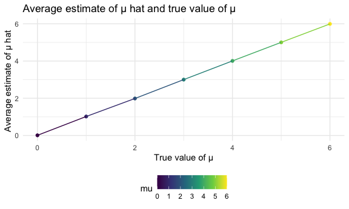

p8105\_hw5\_jh4324
================
Jiying Han

This is my solution for HW5

## Problem 1

read in the data

``` r
homicide_df = 
  read.csv("./data/homicide-data.csv") %>%
  mutate(
    city_state = str_c(city, state, sep = "_"),
    resolved = case_when(
      disposition == "Closed without arrest"~"unsolved",
      disposition == "Open/No arrest"~"unsolved",
      disposition == "Closed by arrest"~"solved"
    )
   ) %>% 
  select(city_state, resolved) %>% 
  filter(city_state != "Tulsa_AL") 
```

let’s look at this a bit

``` r
aggregate_df = 
  homicide_df %>% 
  group_by(city_state) %>% 
  summarize(
    hom_total = n(),
    hom_unsolved = sum(resolved == "unsolved")
  )
```

    ## `summarise()` ungrouping output (override with `.groups` argument)

can i do a prop test for a single city?

``` r
prop.test(
  aggregate_df %>% filter(city_state == "Baltimore_MD") %>% pull(hom_unsolved),
  aggregate_df %>% filter(city_state == "Baltimore_MD") %>% pull(hom_total)) %>% 
 broom::tidy() 
```

    ## # A tibble: 1 x 8
    ##   estimate statistic  p.value parameter conf.low conf.high method    alternative
    ##      <dbl>     <dbl>    <dbl>     <int>    <dbl>     <dbl> <chr>     <chr>      
    ## 1    0.646      239. 6.46e-54         1    0.628     0.663 1-sample… two.sided

try to iterate…

``` r
result_df = 
  aggregate_df %>% 
   mutate(
     prop_tests = map2(.x = hom_unsolved, .y = hom_total, ~prop.test(x = .x, n =.y)),
     tidy_tests = map(.x = prop_tests, ~broom::tidy(.x))
   ) %>% 
  select(-prop_tests) %>% 
  unnest(tidy_tests) %>% 
  select(city_state, estimate, conf.low, conf.high)
```

make a plot

``` r
result_df %>% 
  mutate(city_state = fct_reorder(city_state, estimate)) %>% 
  ggplot(aes(x = city_state, y = estimate)) +
  geom_point() +
  geom_errorbar(aes(ymin = conf.low, ymax = conf.high)) +
  theme(axis.text.x = element_text(angle = 90,vjust = 0.5, hjust = 1))
```


## Problem 2

Import one dataset

Make a spaghetti plot

``` r
spaghetti_plot = 
  path_df %>%
  ggplot(aes(x = week, y = observations, group = arm, color = arm)) + 
  geom_path() +
  labs(
    title = "Observations of control group and experimental group",
    x = "Week",
    y = "Observation"
  )

ggsave("spaghetti_plot.jpg")
```

    ## Saving 6 x 3.6 in image

``` r
spaghetti_plot
```


Comment: In these eight weeks, we can finds that in experimental groups,
the overall observational values are higher than the control groups. And
the trend of the experimental groups is increasing. As for the control
groups, the trend is approximately fluctuate without apparent increasing
or decreasing.

## Problem 3 (simulation - ttest - estimate - pvalue - plot/summarize of pvalue and estiamte by significant different or not)

Generate dataset

``` r
set.seed(1000)

nd_ttest = function(mu){
  norm_df = 
    tibble(x = rnorm(mean = mu, n =30, sd = 5)) 
  
  norm_df %>% 
    summarize(
      t.test(x, mean = 0,conf.level = 0.95) %>% 
      broom::tidy() %>%
      select(estimate,p.value)
                         )
   
}
nd_ttest(0)
```

    ## # A tibble: 1 x 2
    ##   estimate p.value
    ##      <dbl>   <dbl>
    ## 1   -0.758   0.402

``` r
set.seed(1000)
sample_df = function(mu){
  rerun(5000,map(.x = mu, ~nd_ttest(.x))) %>% 
  bind_rows()
}

sample_df(0)
```

    ## # A tibble: 5,000 x 2
    ##    estimate p.value
    ##       <dbl>   <dbl>
    ##  1   -0.758   0.402
    ##  2   -0.593   0.520
    ##  3    1.02    0.267
    ##  4    0.991   0.306
    ##  5    0.183   0.816
    ##  6   -0.101   0.905
    ##  7    1.10    0.166
    ##  8   -1.53    0.129
    ##  9    1.06    0.198
    ## 10   -0.408   0.651
    ## # … with 4,990 more rows

Repeat the above

``` r
set.seed(10000)
mu_df = 
  tibble(
    mu = c(0,1,2,3,4,5,6)
      ) %>% 
  mutate(
    output_lists = map(.x = mu, ~sample_df(.x))
  )
```

Summarize

``` r
set.seed(10000)
mureject_df = 
  mu_df %>% 
  unnest(output_lists) %>% 
  mutate(mu = as.numeric(mu)) %>% 
  group_by(mu) %>% 
  mutate(
    reject = case_when(
      p.value >= 0.05~ 0,
      p.value < 0.05~ 1
    )
  )  %>% 
  mutate(
    mu = as.factor(mu),
    reject = as.numeric(reject)) %>% 
  select(mu,reject) %>% 
  summarize(
    test_total = n(),
    reject_total = sum(reject == "1" ),
    proportion = reject_total/test_total
  )
```

    ## `summarise()` ungrouping output (override with `.groups` argument)

Plot - proportion of time the null was rejected

``` r
set.seed(1000)
mureject_df %>% 
  mutate(mu = as.numeric(mu)-1) %>% 
  ggplot(aes( x = mu , y = proportion, color = mu)) + 
  geom_point() +
  geom_line() +
  labs(
    title = "Association between effect size and power",
    x = "True μ",
    y = "Proportion of times the null was rejected (Power)"
  )
```


Describe the association between effect size and power. With the effect
size increasing, the proportion of times the null was rejected rapidly
increasing, then after the true μ = 4, it becomes steady. And it reaches
1 when true μ = 5.

Plot - Average estimate of μ hat and true value of μ

``` r
 mu_df %>% 
  unnest(output_lists) %>% 
  mutate(mu = as.numeric(mu)) %>% 
  group_by(mu) %>% 
  summarize(
    average_estimate = mean(estimate)
  ) %>% 
  ggplot(aes(x = mu, y = average_estimate, color = mu)) +
  geom_point() +
  geom_line() +
  labs(
    title = "Average estimate of μ hat and true value of μ",
    x = "True value of μ",
    y = "Average estimate of μ hat "
   )
```

    ## `summarise()` ungrouping output (override with `.groups` argument)



Plot - Average estimate of μ hat only in samples for which the null was
rejected and true value of μ

``` r
mu_df %>% 
  unnest(output_lists) %>% 
  mutate(
    mu = as.numeric(mu),
    reject = case_when(
      p.value >= 0.05 ~1,
      p.value < 0.05~ 0
    )
  ) %>% 
  filter(reject == 0) %>% 
  group_by(mu) %>% 
  summarize(
    average_estimate = mean(estimate)
   ) %>% 
  ggplot(aes( x = mu, y = average_estimate, color =mu )) +
  geom_point() +
  geom_line() +
  labs(
    title = "Average estimate of μ hat only in samples for which the null was rejected and true value of μ ",
    x = "True value of μ",
    y = "Average estimate of μ hat"
  )
```

    ## `summarise()` ungrouping output (override with `.groups` argument)


The average estimate of μ hat equal to true μ. But as for average
estimate of μ hat only in samples for which the null was rejected, it
only equals to true mu when mu = 4-6. When true mu = 0-3, especially
when mu close to 0, the number of samples for which the null was
rejected becomes less(draw from the first plot), and within these
samples, the estimate of mu hat is away from true mu, thus it isn’t
equal to the true mu. For true mu approach to 6, more and more samples
are rejected, and most estimate of mu hat far away from true mu,
therefore, the average estimate of mu hat in samples for which the null
was rejected is much closer to true mu and even equal to true mu.
