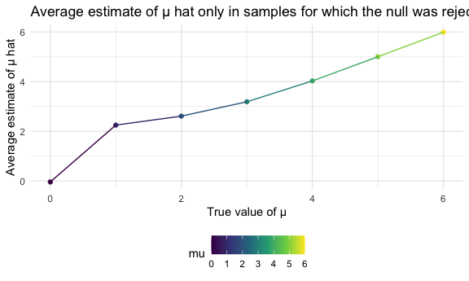

p8105\_hw5\_jh4324
================
Jiying Han
11/13/2020

This is my solution for HW5

## Problem 1

read in the data

``` r
homicide_df = 
  read.csv("./data/homicide-data.csv") %>%
  mutate(
    city_state = str_c(city, state, sep = "_"),
    resolved = case_when(
      disposition == "Closed without arrest"~"unsolved",
      disposition == "Open/No arrest"~"unsolved",
      disposition == "Closed by arrest"~"solved"
    )
   ) %>% 
  select(city_state, resolved) %>% 
  filter(city_state != "Tulsa_AL") 
```

let’s look at this a bit

``` r
aggregate_df = 
  homicide_df %>% 
  group_by(city_state) %>% 
  summarize(
    hom_total = n(),
    hom_unsolved = sum(resolved == "unsolved")
  )
```

    ## `summarise()` ungrouping output (override with `.groups` argument)

can i do a prop test for a single city?

``` r
prop.test(
  aggregate_df %>% filter(city_state == "Baltimore_MD") %>% pull(hom_unsolved),
  aggregate_df %>% filter(city_state == "Baltimore_MD") %>% pull(hom_total)) %>% 
 broom::tidy() 
```

    ## # A tibble: 1 x 8
    ##   estimate statistic  p.value parameter conf.low conf.high method    alternative
    ##      <dbl>     <dbl>    <dbl>     <int>    <dbl>     <dbl> <chr>     <chr>      
    ## 1    0.646      239. 6.46e-54         1    0.628     0.663 1-sample… two.sided

try to iterate…

``` r
result_df = 
  aggregate_df %>% 
   mutate(
     prop_tests = map2(.x = hom_unsolved, .y = hom_total, ~prop.test(x = .x, n =.y)),
     tidy_tests = map(.x = prop_tests, ~broom::tidy(.x))
   ) %>% 
  select(-prop_tests) %>% 
  unnest(tidy_tests) %>% 
  select(city_state, estimate, conf.low, conf.high)
```

make a plot

``` r
result_df %>% 
  mutate(city_state = fct_reorder(city_state, estimate)) %>% 
  ggplot(aes(x = city_state, y = estimate)) +
  geom_point() +
  geom_errorbar(aes(ymin = conf.low, ymax = conf.high)) +
  theme(axis.text.x = element_text(angle = 90,vjust = 0.5, hjust = 1))
```


## Problem 2

import one dataset

``` r
path_df =
  tibble(
  path = list.files("./data/data2")
) %>% 
  mutate(path = str_c("./data/data2/", path),
         observations = map(.x = path, ~read_csv(.x))
         ) %>% 
  separate(path,c("subject_id","format"),sep = ".csv" ) %>% 
  separate(subject_id,c("format","subject_id"),sep = "2/" ) %>% 
  select(-format) %>% 
  separate(subject_id,c("arm","subject_id"),sep = "_") %>% 
  mutate(
  arm = case_when(
      arm == "con"~"control",
      arm == "exp"~"experiment"
    )) %>% 
  unnest(observations) %>% 
  pivot_longer(
    week_1:week_8,
    names_to = "week",
    values_to ="observations"
  ) %>% 
  mutate(
    week = str_replace(week,"week_",""),
    week = as.factor(week)) 
```

    ## Parsed with column specification:
    ## cols(
    ##   week_1 = col_double(),
    ##   week_2 = col_double(),
    ##   week_3 = col_double(),
    ##   week_4 = col_double(),
    ##   week_5 = col_double(),
    ##   week_6 = col_double(),
    ##   week_7 = col_double(),
    ##   week_8 = col_double()
    ## )
    ## Parsed with column specification:
    ## cols(
    ##   week_1 = col_double(),
    ##   week_2 = col_double(),
    ##   week_3 = col_double(),
    ##   week_4 = col_double(),
    ##   week_5 = col_double(),
    ##   week_6 = col_double(),
    ##   week_7 = col_double(),
    ##   week_8 = col_double()
    ## )
    ## Parsed with column specification:
    ## cols(
    ##   week_1 = col_double(),
    ##   week_2 = col_double(),
    ##   week_3 = col_double(),
    ##   week_4 = col_double(),
    ##   week_5 = col_double(),
    ##   week_6 = col_double(),
    ##   week_7 = col_double(),
    ##   week_8 = col_double()
    ## )
    ## Parsed with column specification:
    ## cols(
    ##   week_1 = col_double(),
    ##   week_2 = col_double(),
    ##   week_3 = col_double(),
    ##   week_4 = col_double(),
    ##   week_5 = col_double(),
    ##   week_6 = col_double(),
    ##   week_7 = col_double(),
    ##   week_8 = col_double()
    ## )
    ## Parsed with column specification:
    ## cols(
    ##   week_1 = col_double(),
    ##   week_2 = col_double(),
    ##   week_3 = col_double(),
    ##   week_4 = col_double(),
    ##   week_5 = col_double(),
    ##   week_6 = col_double(),
    ##   week_7 = col_double(),
    ##   week_8 = col_double()
    ## )
    ## Parsed with column specification:
    ## cols(
    ##   week_1 = col_double(),
    ##   week_2 = col_double(),
    ##   week_3 = col_double(),
    ##   week_4 = col_double(),
    ##   week_5 = col_double(),
    ##   week_6 = col_double(),
    ##   week_7 = col_double(),
    ##   week_8 = col_double()
    ## )
    ## Parsed with column specification:
    ## cols(
    ##   week_1 = col_double(),
    ##   week_2 = col_double(),
    ##   week_3 = col_double(),
    ##   week_4 = col_double(),
    ##   week_5 = col_double(),
    ##   week_6 = col_double(),
    ##   week_7 = col_double(),
    ##   week_8 = col_double()
    ## )
    ## Parsed with column specification:
    ## cols(
    ##   week_1 = col_double(),
    ##   week_2 = col_double(),
    ##   week_3 = col_double(),
    ##   week_4 = col_double(),
    ##   week_5 = col_double(),
    ##   week_6 = col_double(),
    ##   week_7 = col_double(),
    ##   week_8 = col_double()
    ## )
    ## Parsed with column specification:
    ## cols(
    ##   week_1 = col_double(),
    ##   week_2 = col_double(),
    ##   week_3 = col_double(),
    ##   week_4 = col_double(),
    ##   week_5 = col_double(),
    ##   week_6 = col_double(),
    ##   week_7 = col_double(),
    ##   week_8 = col_double()
    ## )
    ## Parsed with column specification:
    ## cols(
    ##   week_1 = col_double(),
    ##   week_2 = col_double(),
    ##   week_3 = col_double(),
    ##   week_4 = col_double(),
    ##   week_5 = col_double(),
    ##   week_6 = col_double(),
    ##   week_7 = col_double(),
    ##   week_8 = col_double()
    ## )
    ## Parsed with column specification:
    ## cols(
    ##   week_1 = col_double(),
    ##   week_2 = col_double(),
    ##   week_3 = col_double(),
    ##   week_4 = col_double(),
    ##   week_5 = col_double(),
    ##   week_6 = col_double(),
    ##   week_7 = col_double(),
    ##   week_8 = col_double()
    ## )
    ## Parsed with column specification:
    ## cols(
    ##   week_1 = col_double(),
    ##   week_2 = col_double(),
    ##   week_3 = col_double(),
    ##   week_4 = col_double(),
    ##   week_5 = col_double(),
    ##   week_6 = col_double(),
    ##   week_7 = col_double(),
    ##   week_8 = col_double()
    ## )
    ## Parsed with column specification:
    ## cols(
    ##   week_1 = col_double(),
    ##   week_2 = col_double(),
    ##   week_3 = col_double(),
    ##   week_4 = col_double(),
    ##   week_5 = col_double(),
    ##   week_6 = col_double(),
    ##   week_7 = col_double(),
    ##   week_8 = col_double()
    ## )
    ## Parsed with column specification:
    ## cols(
    ##   week_1 = col_double(),
    ##   week_2 = col_double(),
    ##   week_3 = col_double(),
    ##   week_4 = col_double(),
    ##   week_5 = col_double(),
    ##   week_6 = col_double(),
    ##   week_7 = col_double(),
    ##   week_8 = col_double()
    ## )
    ## Parsed with column specification:
    ## cols(
    ##   week_1 = col_double(),
    ##   week_2 = col_double(),
    ##   week_3 = col_double(),
    ##   week_4 = col_double(),
    ##   week_5 = col_double(),
    ##   week_6 = col_double(),
    ##   week_7 = col_double(),
    ##   week_8 = col_double()
    ## )
    ## Parsed with column specification:
    ## cols(
    ##   week_1 = col_double(),
    ##   week_2 = col_double(),
    ##   week_3 = col_double(),
    ##   week_4 = col_double(),
    ##   week_5 = col_double(),
    ##   week_6 = col_double(),
    ##   week_7 = col_double(),
    ##   week_8 = col_double()
    ## )
    ## Parsed with column specification:
    ## cols(
    ##   week_1 = col_double(),
    ##   week_2 = col_double(),
    ##   week_3 = col_double(),
    ##   week_4 = col_double(),
    ##   week_5 = col_double(),
    ##   week_6 = col_double(),
    ##   week_7 = col_double(),
    ##   week_8 = col_double()
    ## )
    ## Parsed with column specification:
    ## cols(
    ##   week_1 = col_double(),
    ##   week_2 = col_double(),
    ##   week_3 = col_double(),
    ##   week_4 = col_double(),
    ##   week_5 = col_double(),
    ##   week_6 = col_double(),
    ##   week_7 = col_double(),
    ##   week_8 = col_double()
    ## )
    ## Parsed with column specification:
    ## cols(
    ##   week_1 = col_double(),
    ##   week_2 = col_double(),
    ##   week_3 = col_double(),
    ##   week_4 = col_double(),
    ##   week_5 = col_double(),
    ##   week_6 = col_double(),
    ##   week_7 = col_double(),
    ##   week_8 = col_double()
    ## )
    ## Parsed with column specification:
    ## cols(
    ##   week_1 = col_double(),
    ##   week_2 = col_double(),
    ##   week_3 = col_double(),
    ##   week_4 = col_double(),
    ##   week_5 = col_double(),
    ##   week_6 = col_double(),
    ##   week_7 = col_double(),
    ##   week_8 = col_double()
    ## )

``` r
path_df %>% knitr::kable()
```

| arm        | subject\_id | week | observations |
| :--------- | :---------- | :--- | -----------: |
| control    | 01          | 1    |         0.20 |
| control    | 01          | 2    |       \-1.31 |
| control    | 01          | 3    |         0.66 |
| control    | 01          | 4    |         1.96 |
| control    | 01          | 5    |         0.23 |
| control    | 01          | 6    |         1.09 |
| control    | 01          | 7    |         0.05 |
| control    | 01          | 8    |         1.94 |
| control    | 02          | 1    |         1.13 |
| control    | 02          | 2    |       \-0.88 |
| control    | 02          | 3    |         1.07 |
| control    | 02          | 4    |         0.17 |
| control    | 02          | 5    |       \-0.83 |
| control    | 02          | 6    |       \-0.31 |
| control    | 02          | 7    |         1.58 |
| control    | 02          | 8    |         0.44 |
| control    | 03          | 1    |         1.77 |
| control    | 03          | 2    |         3.11 |
| control    | 03          | 3    |         2.22 |
| control    | 03          | 4    |         3.26 |
| control    | 03          | 5    |         3.31 |
| control    | 03          | 6    |         0.89 |
| control    | 03          | 7    |         1.88 |
| control    | 03          | 8    |         1.01 |
| control    | 04          | 1    |         1.04 |
| control    | 04          | 2    |         3.66 |
| control    | 04          | 3    |         1.22 |
| control    | 04          | 4    |         2.33 |
| control    | 04          | 5    |         1.47 |
| control    | 04          | 6    |         2.70 |
| control    | 04          | 7    |         1.87 |
| control    | 04          | 8    |         1.66 |
| control    | 05          | 1    |         0.47 |
| control    | 05          | 2    |       \-0.58 |
| control    | 05          | 3    |       \-0.09 |
| control    | 05          | 4    |       \-1.37 |
| control    | 05          | 5    |       \-0.32 |
| control    | 05          | 6    |       \-2.17 |
| control    | 05          | 7    |         0.45 |
| control    | 05          | 8    |         0.48 |
| control    | 06          | 1    |         2.37 |
| control    | 06          | 2    |         2.50 |
| control    | 06          | 3    |         1.59 |
| control    | 06          | 4    |       \-0.16 |
| control    | 06          | 5    |         2.08 |
| control    | 06          | 6    |         3.07 |
| control    | 06          | 7    |         0.78 |
| control    | 06          | 8    |         2.35 |
| control    | 07          | 1    |         0.03 |
| control    | 07          | 2    |         1.21 |
| control    | 07          | 3    |         1.13 |
| control    | 07          | 4    |         0.64 |
| control    | 07          | 5    |         0.49 |
| control    | 07          | 6    |       \-0.12 |
| control    | 07          | 7    |       \-0.07 |
| control    | 07          | 8    |         0.46 |
| control    | 08          | 1    |       \-0.08 |
| control    | 08          | 2    |         1.42 |
| control    | 08          | 3    |         0.09 |
| control    | 08          | 4    |         0.36 |
| control    | 08          | 5    |         1.18 |
| control    | 08          | 6    |       \-1.16 |
| control    | 08          | 7    |         0.33 |
| control    | 08          | 8    |       \-0.44 |
| control    | 09          | 1    |         0.08 |
| control    | 09          | 2    |         1.24 |
| control    | 09          | 3    |         1.44 |
| control    | 09          | 4    |         0.41 |
| control    | 09          | 5    |         0.95 |
| control    | 09          | 6    |         2.75 |
| control    | 09          | 7    |         0.30 |
| control    | 09          | 8    |         0.03 |
| control    | 10          | 1    |         2.14 |
| control    | 10          | 2    |         1.15 |
| control    | 10          | 3    |         2.52 |
| control    | 10          | 4    |         3.44 |
| control    | 10          | 5    |         4.26 |
| control    | 10          | 6    |         0.97 |
| control    | 10          | 7    |         2.73 |
| control    | 10          | 8    |       \-0.53 |
| experiment | 01          | 1    |         3.05 |
| experiment | 01          | 2    |         3.67 |
| experiment | 01          | 3    |         4.84 |
| experiment | 01          | 4    |         5.80 |
| experiment | 01          | 5    |         6.33 |
| experiment | 01          | 6    |         5.46 |
| experiment | 01          | 7    |         6.38 |
| experiment | 01          | 8    |         5.91 |
| experiment | 02          | 1    |       \-0.84 |
| experiment | 02          | 2    |         2.63 |
| experiment | 02          | 3    |         1.64 |
| experiment | 02          | 4    |         2.58 |
| experiment | 02          | 5    |         1.24 |
| experiment | 02          | 6    |         2.32 |
| experiment | 02          | 7    |         3.11 |
| experiment | 02          | 8    |         3.78 |
| experiment | 03          | 1    |         2.15 |
| experiment | 03          | 2    |         2.08 |
| experiment | 03          | 3    |         1.82 |
| experiment | 03          | 4    |         2.84 |
| experiment | 03          | 5    |         3.36 |
| experiment | 03          | 6    |         3.61 |
| experiment | 03          | 7    |         3.37 |
| experiment | 03          | 8    |         3.74 |
| experiment | 04          | 1    |       \-0.62 |
| experiment | 04          | 2    |         2.54 |
| experiment | 04          | 3    |         3.78 |
| experiment | 04          | 4    |         2.73 |
| experiment | 04          | 5    |         4.49 |
| experiment | 04          | 6    |         5.82 |
| experiment | 04          | 7    |         6.00 |
| experiment | 04          | 8    |         6.49 |
| experiment | 05          | 1    |         0.70 |
| experiment | 05          | 2    |         3.33 |
| experiment | 05          | 3    |         5.34 |
| experiment | 05          | 4    |         5.57 |
| experiment | 05          | 5    |         6.90 |
| experiment | 05          | 6    |         6.66 |
| experiment | 05          | 7    |         6.24 |
| experiment | 05          | 8    |         6.95 |
| experiment | 06          | 1    |         3.73 |
| experiment | 06          | 2    |         4.08 |
| experiment | 06          | 3    |         5.40 |
| experiment | 06          | 4    |         6.41 |
| experiment | 06          | 5    |         4.87 |
| experiment | 06          | 6    |         6.09 |
| experiment | 06          | 7    |         7.66 |
| experiment | 06          | 8    |         5.83 |
| experiment | 07          | 1    |         1.18 |
| experiment | 07          | 2    |         2.35 |
| experiment | 07          | 3    |         1.23 |
| experiment | 07          | 4    |         1.17 |
| experiment | 07          | 5    |         2.02 |
| experiment | 07          | 6    |         1.61 |
| experiment | 07          | 7    |         3.13 |
| experiment | 07          | 8    |         4.88 |
| experiment | 08          | 1    |         1.37 |
| experiment | 08          | 2    |         1.43 |
| experiment | 08          | 3    |         1.84 |
| experiment | 08          | 4    |         3.60 |
| experiment | 08          | 5    |         3.80 |
| experiment | 08          | 6    |         4.72 |
| experiment | 08          | 7    |         4.68 |
| experiment | 08          | 8    |         5.70 |
| experiment | 09          | 1    |       \-0.40 |
| experiment | 09          | 2    |         1.08 |
| experiment | 09          | 3    |         2.66 |
| experiment | 09          | 4    |         2.70 |
| experiment | 09          | 5    |         2.80 |
| experiment | 09          | 6    |         2.64 |
| experiment | 09          | 7    |         3.51 |
| experiment | 09          | 8    |         3.27 |
| experiment | 10          | 1    |         1.09 |
| experiment | 10          | 2    |         2.80 |
| experiment | 10          | 3    |         2.80 |
| experiment | 10          | 4    |         4.30 |
| experiment | 10          | 5    |         2.25 |
| experiment | 10          | 6    |         6.57 |
| experiment | 10          | 7    |         6.09 |
| experiment | 10          | 8    |         4.64 |

make a spaghetti plot

``` r
spaghetti_plot = 
  path_df %>%
  unite("subjects", c(arm, subject_id), sep = "_", remove = TRUE, na.rm = FALSE) %>% 
  ggplot(aes(x = week, y = observations, group = subjects, color = subjects)) + 
  geom_path()

ggsave("spaghetti_plot.jpg")
```

    ## Saving 6 x 3.6 in image

``` r
spaghetti_plot
```


Comment: In these eight weeks, we can finds that in experimental groups,
the overall observational values are higher than the control groups. And
the trend of the experimental groups is increasing. As for the control
groups, the trend is approximately fluctuate without apparent increasing
or decreasing.

## Problem 3 (simulation - ttest - estimate - pvalue - plot/summarize of pvalue and estiamte by significant different or not)

Generate dataset

``` r
set.seed(1000)
df = rerun(5000, map(.x = 0, ~rnorm(n = 30, mean = (.x), sd = 5)))

nd_ttest = function(mu){
  norm_df = 
    tibble(x = rnorm(mean = mu, n =30, sd = 5)) 
  
  norm_df %>% summarize(
    t.test(x, mean = 0,conf.level = 0.95) %>% 
    broom::tidy() %>%
    select(estimate,p.value)
                       )
   
}

set.seed(1000)
sample_df = function(mu){
  rerun(5000,map(.x = mu, ~nd_ttest(.x))) %>% 
  bind_rows()
}

sample_df(0)
```

    ## # A tibble: 5,000 x 2
    ##    estimate p.value
    ##       <dbl>   <dbl>
    ##  1   -0.758   0.402
    ##  2   -0.593   0.520
    ##  3    1.02    0.267
    ##  4    0.991   0.306
    ##  5    0.183   0.816
    ##  6   -0.101   0.905
    ##  7    1.10    0.166
    ##  8   -1.53    0.129
    ##  9    1.06    0.198
    ## 10   -0.408   0.651
    ## # … with 4,990 more rows

Repeat the above

``` r
set.seed(1000)
mu_df = 
  tibble(
    mu = c(0,1,2,3,4,5,6)
      ) %>% 
  mutate(
    output_lists = map(.x = mu, ~sample_df(.x))
  )
```

Summarize

``` r
set.seed(1000)
mureject_df = 
  mu_df %>% 
  unnest(output_lists) %>% 
  mutate(mu = as.numeric(mu)) %>% 
  group_by(mu) %>% 
  mutate(
    reject = case_when(
      p.value >= "0.05" ~1,
      p.value <= "0.05"~ 0
    )
  )  %>% 
  mutate(
    mu = as.factor(mu),
    reject = as.numeric(reject)) %>% 
  select(mu,reject) %>% 
  group_by(mu) %>% 
  summarize(
    test_total = n(),
    reject_total = sum(reject == "1" ),
    proportion = reject_total/test_total
  )
```

    ## `summarise()` ungrouping output (override with `.groups` argument)

plot - proportion of time the null was rejected

``` r
set.seed(1000)
mureject_df %>% 
  mutate(mu = as.numeric(mu)) %>% 
  ggplot(aes( x = mu , y = proportion), color = mu) + 
  geom_point() +
  geom_line() +
  labs(
    title = "Association between effect size and power",
    x = "True μ",
    y = "Proportion of times the null was rejected"
  )
```


Describe the association between effect size and power.

plot - Average estimate of μ hat and true value of μ

``` r
 mu_df %>% 
  unnest(output_lists) %>% 
  mutate(mu = as.numeric(mu)) %>% 
  group_by(mu) %>% 
  summarize(
    average_estimate = mean(estimate)
  ) %>% 
  ggplot(aes(x = mu, y = average_estimate)) +
  geom_point() +
  geom_line() +
  labs(
    title = "Average estimate of μ hat and true value of μ",
    x = "True value of μ",
    y = "Average estimate of μ hat "
   )
```

    ## `summarise()` ungrouping output (override with `.groups` argument)


plot - Average estimate of μ hat only in samples for which the null was
rejected and true value of μ

``` r
mu_df %>% 
  unnest(output_lists) %>% 
  mutate(
    mu = as.numeric(mu),
    reject = case_when(
      p.value >= "0.05" ~1,
      p.value <= "0.05"~ 0
    )
  ) %>% 
  filter(reject == "0") %>% 
  group_by(mu) %>% 
  summarize(
    average_estimate = mean(estimate)
   ) %>% 
  ggplot(aes( x = mu, y = average_estimate)) +
  geom_point() +
  geom_line() +
  labs(
    title = "Average estimate of μ hat only in samples for which the null was rejected and true value of μ ",
    x = "True value of μ",
    y = "Average estimate of μ hat"
  )
```

    ## `summarise()` ungrouping output (override with `.groups` argument)



Is the sample average of μ̂ across tests for which the null is rejected
approximately equal to the true value of μ ? Why or why not?
